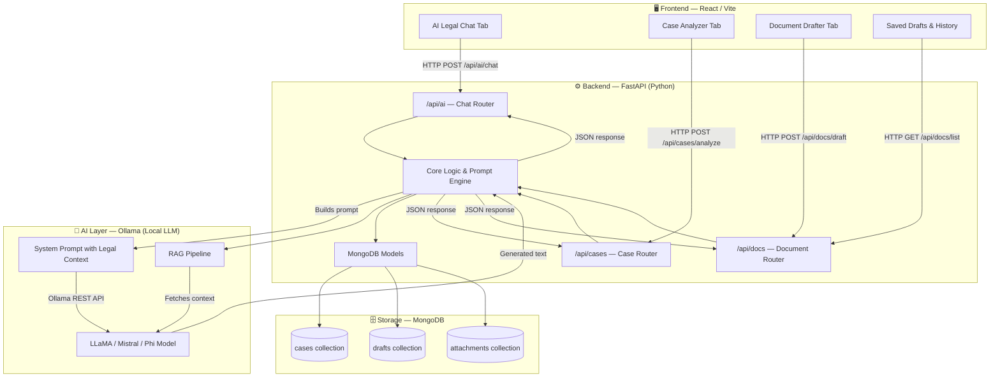
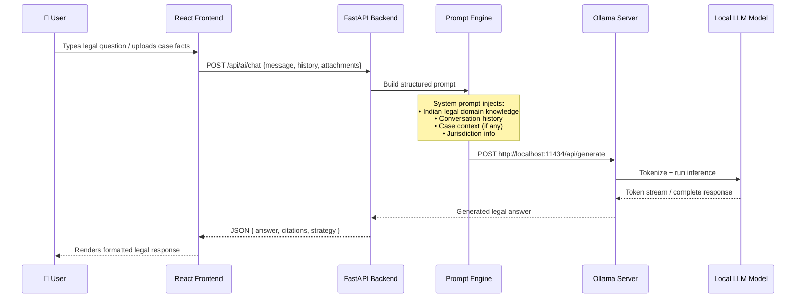
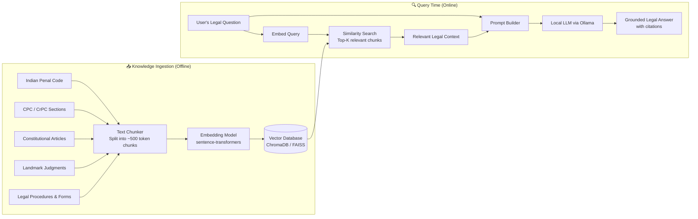
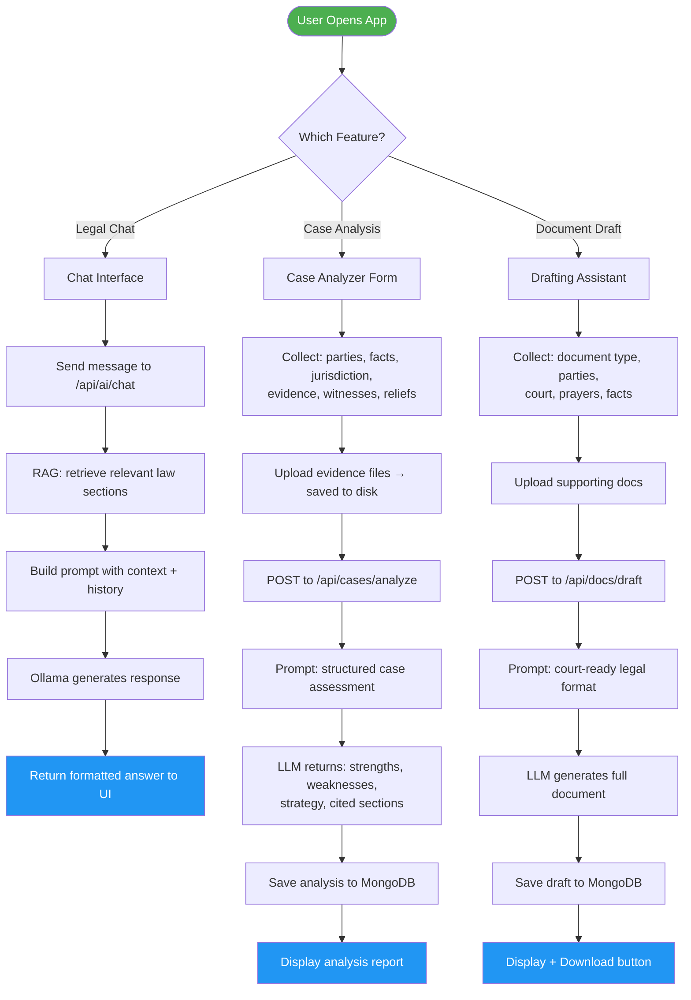

# ⚖️ Nyaya AI — Indian Legal Assistant

<div align="center">


**A full-stack AI-powered Indian legal assistant for lawyers, litigants & researchers — built on local LLMs, RAG, and MongoDB.**

</div>

---

## 📌 Table of Contents

- [What is Nyaya AI?](#-what-is-nyaya-ai)
- [Features](#-features)
- [How It Works — System Architecture](#-how-it-works--system-architecture)
- [LLM Integration (Ollama)](#-llm-integration--how-the-ai-brain-works)
- [RAG — Retrieval Augmented Generation](#-rag--retrieval-augmented-generation)
- [Data Flow Diagram](#-complete-data-flow)
- [Project Structure](#-project-structure)
- [Tech Stack](#-tech-stack)
- [Setup & Installation](#-setup--installation)
- [Environment Variables](#-environment-variables)
- [API Reference](#-api-reference)
- [Deployment](#-deployment)
- [Contributing](#-contributing)

---

## 🏛 What is Nyaya AI?

**Nyaya** (न्याय) means *justice* in Sanskrit. This project is a full-stack AI legal assistant designed specifically for the **Indian legal system**. It helps:

- 🧑‍⚖️ **Lawyers** draft court-ready documents and analyze case strategy
- 📋 **Litigants** understand their legal position, rights, and relief options
- 🔍 **Researchers** query Indian law, judgments, and procedural rules

Unlike generic chatbots, Nyaya AI understands **Indian legal context** — CPC, CrPC, IPC, Constitution, jurisdiction hierarchies, and procedural nuances — because the underlying LLM is fine-tuned and prompted with domain-specific legal knowledge.

---

## ✨ Features

| Feature | Description |
|---|---|
| 💬 **AI Legal Chat** | Context-aware Q&A on Indian law, procedure, and rights |
| 🔬 **Case Analyzer** | Structured assessment of facts, jurisdiction, evidence, witnesses, and reliefs |
| 📄 **Document Drafter** | Generates plaints, notices, applications, affidavits in court-ready format |
| 📎 **File Attachments** | Upload evidence files and supporting documents alongside case data |
| 💾 **Persistent Storage** | All analyses and drafted documents saved in MongoDB |
| ⬇️ **Draft Download** | Download generated legal drafts directly from the UI |
| 🏠 **Local AI** | Runs on Ollama — **no data leaves your machine**, fully private |

---

## 🏗 How It Works — System Architecture

The app is divided into three main layers: a **React frontend**, a **FastAPI backend**, and a **local AI inference layer** via Ollama. MongoDB acts as the persistence store.



---

## 🤖 LLM Integration — How the AI Brain Works

Nyaya AI uses **Ollama** to run a large language model **completely locally** on your machine. Here's the detailed flow:



### Why Ollama?

Ollama is a local model server that lets you run open-source LLMs (like LLaMA 3, Mistral, or Phi-3) on your own hardware without sending data to any external API. This is critical for legal applications where **client confidentiality** matters.

- No API key required
- Zero data leaves your machine
- Works offline
- Supports multiple models — swap without code changes
- Low latency on modern CPUs/GPUs

---

## 📚 RAG — Retrieval Augmented Generation

RAG is the technique that makes Nyaya AI **actually know Indian law** instead of hallucinating. Here's how it works:



### RAG in Plain Language

1. **Before you run the app** — Legal documents (IPC sections, CPC rules, SC judgments) are split into small chunks and converted into numerical vectors (embeddings) using a sentence transformer model. These vectors are stored in a vector database (like ChromaDB or FAISS).

2. **When a user asks a question** — The question is also converted into a vector. The system finds the most *semantically similar* chunks from the legal knowledge base.

3. **Context injection** — Those relevant legal chunks are injected into the LLM's prompt alongside the user's question. The LLM then generates an answer *grounded in actual legal text*, reducing hallucination.

4. **Result** — The user gets a legally accurate answer with proper references to sections, articles, or judgments.

---

## 🔄 Complete Data Flow



---

## 📁 Project Structure

```
AIAssistant/
│
├── backend/                        # Python FastAPI backend
│   ├── app/
│   │   ├── main.py                 # FastAPI app entry point, CORS, router mounting
│   │   ├── config.py               # Env vars: OLLAMA_HOST_URL, MONGO_URI, PORT
│   │   ├── database.py             # MongoDB async connection helper (motor)
│   │   └── routers/
│   │       ├── ai.py               # /api/ai — chat, RAG query, Ollama calls
│   │       ├── cases.py            # /api/cases — case CRUD + AI analysis
│   │       └── documents.py        # /api/docs — draft generation + file save
│   └── requirements.txt
│
├── frontend/                       # React + Vite frontend
│   ├── src/
│   │   ├── App.jsx                 # Root component, tab-based routing
│   │   ├── App.css                 # Global styles
│   │   └── components/
│   │       ├── ChatAssistant.jsx   # AI Legal Chat UI
│   │       ├── CaseAnalyzer.jsx    # Case facts form + analysis display
│   │       ├── DocumentDrafter.jsx # Document drafting form + download
│   │       └── SavedDrafts.jsx     # History browser for past drafts
│   ├── index.html
│   ├── vite.config.js
│   └── package.json
│
├── .gitignore
└── README.md
```

---

## 🛠 Tech Stack

| Layer | Technology | Purpose |
|---|---|---|
| **Frontend** | React 18 + Vite | SPA UI with fast HMR dev server |
| **Styling** | CSS Modules | Component-scoped styles |
| **Backend** | FastAPI (Python) | REST API, async routes, file handling |
| **AI Inference** | Ollama | Local LLM server (no cloud dependency) |
| **LLM Models** | LLaMA 3 / Mistral / Phi-3 | Legal reasoning & drafting |
| **RAG** | sentence-transformers + ChromaDB/FAISS | Semantic retrieval of legal docs |
| **Database** | MongoDB (motor async) | Persisting case analyses & drafts |
| **File Storage** | Local disk (FastAPI static) | Evidence & supporting document uploads |
| **API Client** | Axios / fetch | Frontend ↔ Backend HTTP calls |

---

## 🚀 Setup & Installation

### Prerequisites

- Python 3.11+
- Node.js 18+
- [MongoDB](https://www.mongodb.com/try/download/community) running locally or a MongoDB Atlas URI
- [Ollama](https://ollama.com) installed and running

### 1. Pull an Ollama model

```bash
# Pull a capable model (choose one)
ollama pull llama3          # Meta LLaMA 3 (8B) — recommended
ollama pull mistral         # Mistral 7B — lighter alternative
ollama pull phi3            # Microsoft Phi-3 — fastest on CPU
```

### 2. Clone the repository

```bash
git clone https://github.com/quantumNexus0/AIAssistant.git
cd AIAssistant
```

### 3. Backend setup

```bash
# Create and activate virtual environment
python -m venv .venv

# Windows (PowerShell)
.\.venv\Scripts\Activate.ps1

# macOS / Linux
source .venv/bin/activate

# Install dependencies
pip install -r backend/requirements.txt

# Start the backend
uvicorn backend.app.main:app --reload --host 0.0.0.0 --port 8000
```

### 4. Frontend setup

```bash
cd frontend
npm install
npm run dev
```

Open the URL shown in the terminal (typically `http://localhost:5173`).

---

## 🔧 Environment Variables

Create a `.env` file in the project root or export these in your shell:

| Variable | Default | Description |
|---|---|---|
| `OLLAMA_HOST_URL` | `http://localhost:11434` | URL of the running Ollama server |
| `MONGO_URI` | `mongodb://localhost:27017` | MongoDB connection string |
| `DATABASE_NAME` | `nyaya_ai` | MongoDB database name |
| `PORT` | `8000` | FastAPI server port |

```bash
# Example .env
OLLAMA_HOST_URL=http://localhost:11434
MONGO_URI=mongodb://localhost:27017
DATABASE_NAME=nyaya_ai
PORT=8000
```

---

## 📡 API Reference

### Chat Endpoint

```
POST /api/ai/chat
Content-Type: application/json

{
  "message": "What is Section 498A IPC?",
  "history": [{ "role": "user", "content": "..." }, { "role": "assistant", "content": "..." }]
}
```

### Case Analysis

```
POST /api/cases/analyze
Content-Type: multipart/form-data

Fields: jurisdiction, plaintiff, defendant, facts, orders, evidence[], witnesses[], reliefs[]
Files:  attachments[] (optional)
```

### Document Drafting

```
POST /api/docs/draft
Content-Type: multipart/form-data

Fields: document_type, court, plaintiff, defendant, prayers, facts
Files:  supporting_docs[] (optional)
```

### List Saved Drafts

```
GET /api/docs/list
Response: [{ id, document_type, created_at, preview }]
```

---

## 🚢 Deployment

### Backend (Docker / systemd)

```bash
# Build and run as Docker container
docker build -t nyaya-backend ./backend
docker run -p 8000:8000 \
  -e OLLAMA_HOST_URL=http://host.docker.internal:11434 \
  -e MONGO_URI=mongodb://host.docker.internal:27017 \
  nyaya-backend

# Or with Gunicorn for production
gunicorn backend.app.main:app -w 2 -k uvicorn.workers.UvicornWorker --bind 0.0.0.0:8000
```

### Frontend (Static Build)

```bash
cd frontend
npm run build          # Outputs to frontend/dist/
# Serve with Nginx, Vercel, or integrate with FastAPI StaticFiles
```

---

## 🤝 Contributing

Contributions are welcome! Here's how the codebase is organized for extensibility:

- **Add a new AI feature** → Create a new router in `backend/app/routers/` and a new React component in `frontend/src/components/`
- **Swap the LLM model** → Change the model name in `backend/app/routers/ai.py` and pull it via `ollama pull <model>`
- **Extend RAG knowledge** → Add new legal documents to the ingestion pipeline and re-run the embedding step
- **Add a new document type** → Extend the prompt templates in the document drafting router

---

## 🔒 Privacy & Security

Because Nyaya AI runs entirely on **local infrastructure**:
- No client data is sent to external AI APIs
- All LLM inference happens on your machine via Ollama
- MongoDB stores data locally by default
- File attachments remain on your server

This makes Nyaya AI suitable for use in professional legal environments where **client confidentiality** (under Bar Council rules) must be maintained.

---


<div align="center">
Made with ⚖️ for the Indian legal community
</div>
