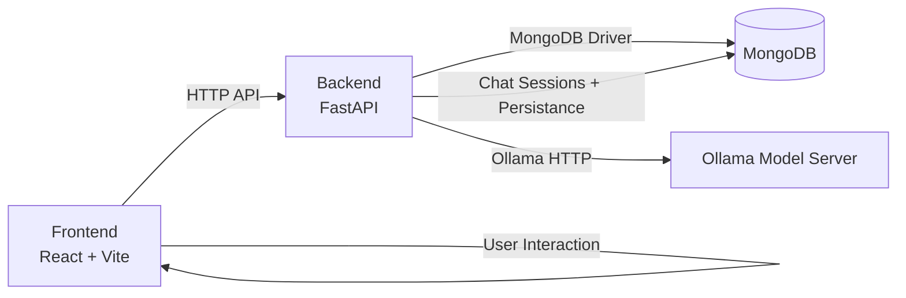

# Nyaya AI Legal Assistant

A full-stack Indian legal assistant application built with a React/Vite frontend and a FastAPI backend. It combines legal knowledge, chat-driven conversation, rights exploration, case analysis, and document drafting using AI-powered reasoning.

## Overview

Nyaya AI provides:
- **AI Legal Chat** for Indian law questions and legal guidance
- **Know Your Rights** explorer with constitutional and statutory rights
- **Case Analyzer** to summarize and analyze legal matters
- **Document Drafter** for legal forms, notices, and applications
- **Legal Tools & References** for laws, acts, and procedural guidance

The project includes a modern browser UI in `frontend/` and a MongoDB-backed API server in `backend/`.

## Architecture



If Mermaid diagrams are not rendered, the architecture can be understood as:

```
Frontend (React/Vite)
      |
      v
Backend (FastAPI)
     / \
    /   \
MongoDB  Ollama AI Inference
```

## Features

- **AI conversation tab** with contextual legal chat and model selection
- **Truth & rights tab** with curated constitutional rights cards
- **Case analysis tab** for structured legal matter breakdown
- **Document drafting tab** for legal notices and pleadings
- **Legal tools tab** for key Indian laws and citations
- **MongoDB persistence** for chat history and session storage

## Project structure

- `backend/`
  - `app/main.py` — FastAPI application entry point
  - `app/config.py` — environment configuration values
  - `app/database.py` — MongoDB connection helpers
  - `app/routers/` — API router modules for AI, chats, cases, documents
- `frontend/`
  - `src/` — React app source files
  - `src/components/` — UI components for tabs and layout
  - `App.jsx` — root app and tab switcher
  - `App.css` — global styling
  - `package.json` — frontend dependencies and scripts

## Technology stack

- Frontend: React 19, Vite, lucide-react icons, modern CSS
- Backend: Python FastAPI, Uvicorn, Pydantic, Motor, HTTPX
- Persistence: MongoDB
- AI integration: Ollama inference via HTTP

## Setup

### Backend

1. Create and activate a Python virtual environment:
   ```powershell
   python -m venv .venv
   .\.venv\Scripts\Activate.ps1
   ```
2. Install requirements:
   ```powershell
   pip install -r backend/requirements.txt
   ```
3. Configure environment variables as needed:
   - `OLLAMA_HOST_URL` (default: `http://localhost:11434`)
   - `MONGO_URI` (default: `mongodb://localhost:27017`)
   - `DATABASE_NAME` (default: `nyaya_ai`)
   - `PORT` (default: `8000`)
4. Run the backend:
   ```powershell
   uvicorn backend.app.main:app --reload --host 0.0.0.0 --port 8000
   ```

### Frontend

1. Install dependencies:
   ```powershell
   cd frontend
   npm install
   ```
2. Start the dev server:
   ```powershell
   npm run dev
   ```
3. Open the app in the browser (default Vite address).

## Environment variables

These values are read from the environment by `backend/app/config.py`:

- `OLLAMA_HOST_URL` — Ollama inference server URL
- `MONGO_URI` — MongoDB connection URI
- `DATABASE_NAME` — Mongo database name
- `PORT` — backend server port

## Running the app

- Start MongoDB locally or use a hosted MongoDB cluster.
- Ensure Ollama is running and accessible at the configured host.
- Launch the backend, then start the frontend dev server.

## Deployment notes

- Use `npm run build` in `frontend/` to create a production build.
- Serve the production frontend from a static host or integrate with the backend.
- Deploy the FastAPI backend using Uvicorn, Gunicorn, or a container.

## Contributing

- Make changes in the `frontend/src/` or `backend/app/` directories.
- Keep API routes in the `routers/` folder.
- Use descriptive commits and keep generated Python cache files out of version control.

## License

This repository does not include a license file by default. Add a license file if you want to open-source the project.
